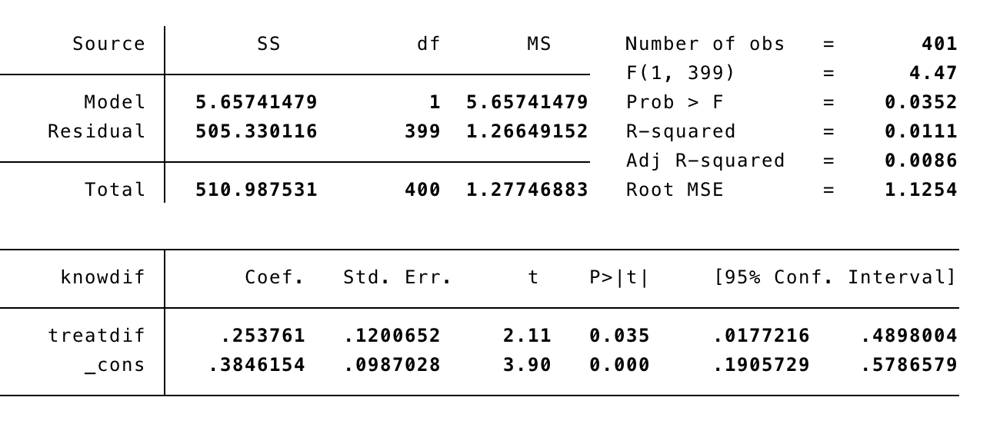
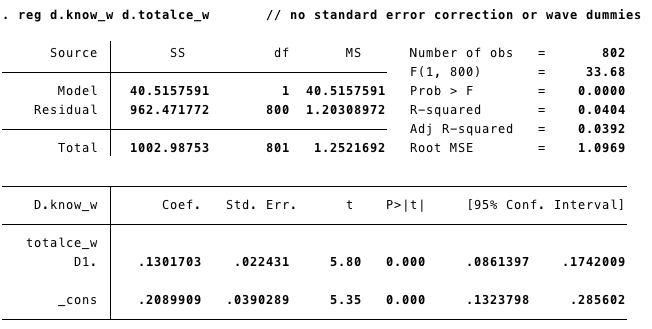
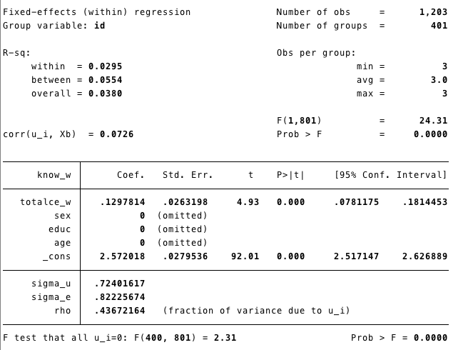
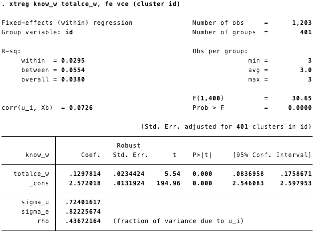
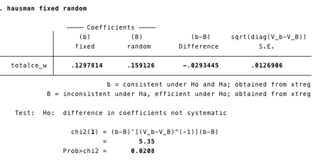
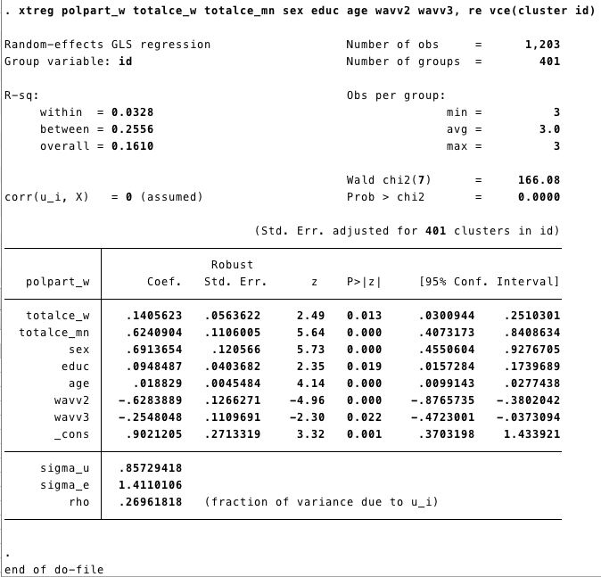

```{r setup, include=FALSE}
knitr::opts_chunk$set(echo = TRUE)
```

# Within estimators models <a name="FE"></a>

## First Difference two waves <a name="FDtw"></a>
Model: 

$$ Y_{it}-Y_{i(t-1)} = X_{1i}-X_{1i(t-1)}+X_{2i}-X_{2i(t-1)}+ \epsilon_i-\epsilon_{i(t-1)}$$

or (Multiwave)

$$ \Delta Y_i= \Delta X_{1i} + \Delta X_{2i} + .. \Delta \epsilon_i$$

**Data details**

We are going to retrieve the data Finkel-Smith 2011. You can find more details about the data here [Datas](#cleaning) 

This data is in wide format. We will create two variables

- Knowdif ($\Delta Knowledge$): difference in knowledge bewteen before and after treatment
- newtreat_ww2 ($\Delta Treatment$): binary variable, "1" if the subject got the treatment. 

### <span style="color:red">**STATA**</span>

- Creating the variables: 

```{r, eval = FALSE}
gen knowdif=know_w2-know_w1
gen treatdif=newtreat_ww2-newtreat_ww1
gen intdif=interest_w2-interest_w1
```
- Runing the models

<span style="color:blue">FD_1: First Difference without controls</span>

```{r eval=FALSE}
regress knowdif newtreat_ww2
```

```{r echo=FALSE, out.width='80%'}

```

<span style="color:blue">FD_2: First Difference with controls</span>


```{r eval=FALSE}
regress knowdif treatdif intdif sex educ
```

```{r echo=FALSE, out.width='80%'}
knitr::include_graphics('./Stata_images/fd2.png')
```

We can add time invariant variables in our model. However the interpretation is not straighforward. For example, in this case, sex and education have negative effects on change in knowledge. This could mean three differnt things: 

    - Women increase more on knwoledge than men, and less educated subjects increase more than highly educated. 
    - Or: sex and education had greater effects on levels of knowldge at time 1 than time 2.
    - Or: sex and education differences were stronger at time 1 than time 2.

### <span style="color:red">**R**</span>

Now we replicate the models **FD_1** and **FD_2** using R. 

- First, we get the data using the function "import" (package rio). 
- Then we add the variables using  "$". 

```{r, echo=FALSE, message=FALSE}
library(rio)
library(dplyr)
library(tidyr)
```


```{r}
data=import("./datasets/Kenya.3wave wide.2017.dta")
data$Knowdif=data$know_w2-data$know_w1 ## Variable Knowdig
data$treatdif=data$newtreat_ww2-data$newtreat_ww1 ## Vairable treatdif
```


```{r eval=FALSE, class.source="Comment1"}
Packages as "dplyr" or "tydr" are giving us more options for data managment. 
For instance we can do everything in "one" line of code.
```%>%``` 
(it means: "throw the object/output from the left in to the next function") 
```

- In this code below we import the dataset and then "throw" it to the function "mutate" to create new variables (Knowdif and treatdif). 
- The outuput is the same. 

```{r, eval=FALSE}
data=import("./datasets/Kenya.3wave wide.2017.dta")%>%mutate(Knowdif=know_w2-know_w1,treatdif=newtreat_ww2-newtreat_ww1, intdif=interest_w2-interest_w1)
```

**Runing the models**

First option: Create and object that contains all the information of the model and then ask for the summary of the model. 

- The function "lm" means "linear model" and it does all the estimation process of the linear model. The dependent and independent variables are separated by "~", and then, after the coma, we called the data. 
- The function ```summary``` allow us to get relevant information of the model. 

```{r}
FD1=lm(Knowdif~treatdif, data)
summary(FD1) 
```

- the object "m1" it has more information that was showed in the summary output. For instance, if we want an analysis of variance of the model we can get that with the function "aov". 

```{r}
aov(FD1)
```

```{r}
summary(aov(FD1))
```

Another option is to run all in one line of code, that could be done using the "%>%". We throw the linear model into the function summary, in this case we are not saving any object in the memory. 

```{r}
lm(data$Knowdif~data$treatdif, data)%>%summary() 
```

Now the model FD2:

We can add more independent/explanatories variables using "+".

```{r, echo=FALSE}
data=import("./datasets/Kenya.3wave wide.2017.dta")%>%mutate(Knowdif=know_w2-know_w1,treatdif=newtreat_ww2-newtreat_ww1, intdif=interest_w2-interest_w1)
```

```{r}
FD2=lm(Knowdif~treatdif+intdif+sex+educ, data)
summary(FD2) 
```

The interpretation is the same stated above.

## Multiwave First Difference <a name="FD_MW"></a>

With the data in long format we can run a Multi Wave First Different Model: 

$$ \Delta Y_i= \Delta X_{1i} + \Delta X_{2i} + .. \Delta \epsilon_i$$

### <span style="color:red">**STATA**</span>

In STATA first we set the data as panel with ```xtset``` and then we run the model using ```d``` before each variable. This will tell STATA to take the difference of said variable at its previous time and include it in the model. 

<span style="color:blue">**MWFD1: Multiwave First Difference without waves**</span>

```{r , eval=FALSE}
xtset id wave
reg d.know_w d.totalce_w  
```

```{r echo=FALSE, out.width='80%'}

```

<span style="color:blue">**MWFD2: Multiwave First Difference controling by waves(time)**</span>

We can run this model controling for the "trend" effect adding the waves. 


```{r , eval=FALSE}
tab wave, gen(wavv) #//this generates two variables, one for each wave
reg d.know_w d.totalce_w wavv2 wavv3 #// The new model
```

```{r echo=FALSE, out.width='80%'}
knitr::include_graphics('./Stata_images/fdmw2.png')
```

If our data is in a long format, we can also use the 
```xtreg``` command. 

- ```xtset``` Sets the data as panel.

```{r, eval=FALSE}
xtset id wave
xtreg d.know_w d.totalce_w
```

```{r echo=FALSE, out.width='80%'}
knitr::include_graphics('./Stata_images/fdmw_2.png')
```

### <span style="color:red">**R**</span>

In R we can use the plm package to run a Multiwave First Difference

<span style="color:blue">**MWFD1: Multiwave First Difference without waves**</span>

- First, we call the package plm. Remember we already called the package **rio** in the step before. 
- Second, we import the data base using "import", as we did in our previous step [here](#rio) 
- ```plm``` is the function for panel model. As in the linear model, the first element on the function is the  *model(formula)* ```know_w~totalce_w+age+educ+sex```. 
- Variables are added using +. then we include the data ```data =K_long```. - The third element in our code is the "index" ```index = c("id", "wave")```, which does the same job that "xtset" in STATA. 
- Finally, we need to specified the type of model ```model = "fd"```. We have several options here that we will be unveiling as we progress. 

- ```summary(MWFD1)``` show us the results. 

```{r message=FALSE}
library(plm)

K_long<-import("~/Dropbox/Finkel-Incio/PS2701 Stata Files/Unit 1 -- Causal Inference and Econometrics/Kenya.3wave long.2017.dta")  ### Here I'm importing the data. 
```

```{r}
MWFD1<-plm(know_w~totalce_w+age+educ+sex,data =K_long,
          index = c("id", "wave"), 
          model = "fd")
summary(MWFD1)
```

<span style="color:blue">**MWFD2: Multiwave First Difference controling by waves(time)**</span>

First we need to create a dummy for each wave. There are different ways to create this dummies. We are going to use the function ```mutate``` from ```dplyr```. We have used that function [here](#mutate)

```{r}
K_long<-K_long%>%mutate(wavv1=ifelse(wave==1,1,0),
                        wavv2=ifelse(wave==2,1,0),
                        wavv3=ifelse(wave==3,1,0))
```

Now we can include waves in the model, two waves are omited due to multicoliniarity. 

```{r}
FDMW2<-plm(know_w~totalce_w+wavv1+wavv2,data =K_long,
          index = c("id", "wave"), 
          model = "fd")
summary(FDMW2)
```


## Simple FE <a name="FE1"></a>

Two more common models: 

$$Y_{it}=\alpha + \beta_1X_{1it}+...\beta_kX_{ikt}+\beta_mZ_i+c_1D_1+c_2D_2+c_{n-1}D_{n-1}+e_{it}$$

In the model above we add a dummy variable ("D") for each unit, this model is common called ("Least Squares Dummy Variables"). Then each unite will have its own intercept, for instance ($\alpha +c1$) for unite 1. A drawback with this model is that is too computationally demanding, especially if we have a large number of units. 

The most common model is the Fixed Effect model: 

$$Y_{it}-\bar{Y_i}=\beta_i(X_{1it}-\bar{X}_{1i})+...+ \beta_k(X_{kit}-\bar{X}_{ki})+ \epsilon_{it}$$

These model control for the variation **between** units and only use the within estimators. 

To estimate these models we are going to use the data from Finkel-Smith 2011 in its long format. You can donwload it here: 

- You can find more details about the data here [Datas](#cleaning) 

### <span style="color:red">**STATA**</span>

```xtset``` Sets the data as panel.
```gen``` Creats or generates a new variable "time" (starts in 0)

```{r eval=FALSE}
xtset id wave
gen time=wave-1
```

**Runing the model**

  - ```Know_w``` = level of knowledge.
  - ```tatalce_w```=
  - ```fe``` means fixed effect

```{r eval=FALSE}
xtreg know_w totalce_w sex educ age, fe 
```

```{r echo=FALSE, out.width='80%'}

```

Time invariants covariates are rid of the model (because they do not vary within subjects!)

### <span style="color:red">**R**</span>

- There are several packages that can help us to estimate panel models. There is some overlapping, however, some packages can take a specific approach for a given problem. For instance **plm** was created by econometricians and **panelR** by a sociologist. The best practice is to use the package that can help us with our analysis and not to get attached to any in particular. 

- Here is a good post from panelR's author comparing his package with plm. [Post](https://www.r-bloggers.com/comparing-panelr-and-plm/)

<span style="color:blue">**R- plm**</span>

- If you hadn't before: First, we call the package.
- Second, we import the database using "import"
- ```plm``` is the function for panel model. As the linear model, the first element is the *model* ```know_w~totalce_w+age+educ+sex```. Variables are added using +. then we include the data ```data =K_long```. The third element in our code is the "index" ```index = c("id", "wave")```. Which does the same job that "xtset" in STATA. Finally, we need to specify the type of model ```model = "within"```. We have several options here, that we are unveiling as we progress. 
- ```summary(FE)``` shows us the results. 

```{r eval=FALSE, class.source="Comment1"}
We do not have to call the package everytime we run a function, only once in a session. 

For instance we called library(rio) before, therefore we do not need to call it again
```


```{r, message=FALSE}
K_long<-import("~/Dropbox/Finkel-Incio/PS2701 Stata Files/Unit 1 -- Causal Inference and Econometrics/Kenya.3wave long.2017.dta")
FE<-plm(know_w~totalce_w+age+educ+sex,data =K_long,
        index = c("id", "wave"), 
        model = "within")
summary(FE)
```

The summary of the model does not give us the "intercept". Stata estimates the intercept running the model after adding the overall sample mean for Y and X to the demeaned X and Y.

**plm** has a function to obtain it

```{r}
within_intercept(FE)
```

In this case the result is the same as the output from the STATA command. 

<span style="color:blue">**R- panelR**</span>
- If you hadn't before: First, we call the package.
- We "panel" our data ```panel_data(K_long, id=id, wave=wave)```. We created a new object (K_long_p). We could also replace the previous one.The advantage of R (compare to STATA), is that we can have more than one data "open" in our enviroment. 


```{r, message=FALSE}
library(panelr) 
K_long_p<-panel_data(K_long, id=id, wave=wave)
head(K_long_p)
```

- Second, we run the model using the function "wbm". The structure is the same as "plm". 

```{r, message=FALSE}
FE2<-wbm(know_w~totalce_w+age+educ+sex, data=K_long_p,
        model="within")
summary(FE2)
```

## FE, robust standard errors (RSE). <a name="FE2"></a>

We can deal with the heteroskedasticity of the error terms obtaining the "ROBUST" standard errors. Panel analysis has potential problems with the error terms produced by unit-level clustering. 

### <span style="color:red">**STATA**</span>

```{r, eval=FALSE}
xtreg know_w totalce_w, fe (cluster id)
```

```{r echo=FALSE, out.width='80%'}

```

As we can see, now the SE are "robust". 

### <span style="color:red">**R**</span>

<span style="color:blue">**R- plm**</span>

- We have more than one option to get the *robust standard errors* from our model. 
- With PLM we can add the argument ```vcov``` in ```summary()```
- Remember: our model was stored in the object **FE** above. 

```{r}
summary(FE,vcov = vcovHC(FE))
```

- Another option is to use a generic function to test our coeficients. The function ```coeftest``` from the package **lmtest** performs z and t Wald tests (significance) of the estimated coefficients. 
- The argument **vcov** allows us to select a particular variance-covariance matrix. 

```{r, message=FALSE}
library(lmtest)
coeftest(FE, vcov = vcovHC, type = "HC1")
```

- Now we use get the robust standard error for the intercept. 

```{r}
within_intercept(FE, vcov = function(x) 
  vcovHC(x, type="HC1"))
```

<span style="color:blue">**R- panelR**</span>

- Panel R does not have implemented yet a easy way to test the coeficients with Robust Standar Error. 

## Random Effects Models <a name="RE"></a>

- Also known as **Random Intercept**

### <span style="color:red">**STATA**</span>

- We also use xtreg for **random effects** model. 
- We add **theta** ($\theta$) in the line. Because $\theta$ gives us an idea of the composition of the error term. As $\theta$
(theta) gets closer to 1, it means that more and more of the composite error variance is made up of $U_i$ unit-level or “between” variance. Where $\theta$ closser to 1 the RE models reduce to a FE model

```{r, eval=FALSE }
xtreg know_w totalce_w sex educ age, re theta
```

```{r echo=FALSE, out.width='80%'}
knitr::include_graphics('./Stata_images/re_1.png')
```

- We can also add **Robust Standard Errors** to the model. We added ```vce(cluster id)``` same as we did with the Fixed Effects model.  


```{r, eval=FALSE }
xtreg know_w totalce_w sex educ age, re vce (cluster id) 
```

### <span style="color:red">**R**</span>

- We run the model using the function **plm** from the package with the same name. 
- The code follows the same structure as the FE or Multiwave First Difference showed above. 
- The difference is in model we select **random**: ```model = "random"```
- 
```{r}
RE<-plm(know_w~totalce_w+age+educ+sex,data =K_long,
        index = c("id", "wave"), 
        model = "random")

summary(RE)
```

- ```summary(RE)``` give us the basic information from the model.
- The results are the same as the STATA output, and **plm** give us $\theta$ by default. 

**Robust standard errors**

- We can get the **robust standard errors adding the argument in the function ```summary()``` as we did with FE models 

```{r}
summary(RE, vcov = vcovHC(RE))
```


## Hasmaun test <a name="ht"></a>

If you are unsure about if to use FE or RE, the Hausmaun Test (HT) can help you to decide. The HT tests if the estimates obtained by the Fixed Effect models are the same as those from the Random Effect model. If they are the same, RE it is more efficient. 

The test statistic is : 

$$
\frac{\beta_{Fe}-\beta_{RE}}{var(\beta_{FE})-var(\beta_{RE})}
$$


With a $\chi^2$ (Chi-square)  with degree of freedom equal to the number of time-varying independent variables. 

### <span style="color:red">**STATA**</span>

To conduct the Hausman Test we need to store the coefficient from our Fixed Effect and Random Effects model. 

- ```qui``` is to estimate the model but no showing the output.
- ```estimate store``` save the estimates from the model in the "object" fixed and random respectively. 

```{r, eval=FALSE}
qui xtreg know_w totalce_w sex educ age, fe  
estimates store fixed

qui xtreg know_w totalce_w sex educ age, re theta
estimates store random
```
We conduct the Hausman test using the command: ```hausman fixed random```

```{r, eval=FALSE}
hausman fixed random
```

```{r echo=FALSE, out.width='80%'}

```

### <span style="color:red">**R**</span>

The package **plm** has a function called ```phtest``` to conduct the Hausman test. 

- We have created the models before, but we will do it again to be sure we are comparing the right estimators.

```{r}
FE<-plm(know_w~totalce_w+age+educ+sex,data =K_long,
        index = c("id", "wave"), 
        model = "within") 

RE<-plm(know_w~totalce_w+age+educ+sex,data =K_long,
        index = c("id", "wave"), 
        model = "random")
```

- Now we can conduct the Hausman test. 

```{r}
phtest(FE, RE)
```

- Another way: ```phtest``` let us run the test withour re-running the model

- We create the object **model** that contains the name of the dependent and independent variables (separated by ~)
-  

```{r}
modht= know_w~totalce_w+age+educ+sex #an object with the model 
phtest(modht, data=K_long)  #We can run the test with the model. 
```

# Hybrid Models <a name="hybrid1"></a>
## Bell and Jones Model with RSE

- It includes the mean of the time variant variables into a RE model
- First we generate the mean of **totalce_w** by group and then included it  in the model. 

### <span style="color:red">**STATA**</span>

```{r, eval=FALSE}
egen totalce_mn=mean(totalce_w), by (id) // egen creates new  variables

xtreg polpart_w totalce_w totalce_mn sex educ age wavv2 wavv3, re vce(cluster id) 
```


```{r echo=FALSE, out.width='80%'}

```

### <span style="color:red">**R**</span>

- First, we create **totalce_mn**, which is the mean of **totalce_w** by group. To do it we will use the function **mutate** from the package **dplyr**. 
- We are going to use the dummys variables for wave. We had created those dummys using mutate for the Multiwave First Difference model [here](#FD_MW)

- We can do it again, just in case: 
```{r }
K_long<-K_long%>%mutate(wavv1=ifelse(wave==1,1,0),
                        wavv2=ifelse(wave==2,1,0),
                        wavv3=ifelse(wave==3,1,0))
```

```{r}
K_long<-K_long%>%group_by(id)%>%
  mutate(totalce_mn=mean(totalce_w))%>%
  ungroup() # if you don't ungroup you may encounter the following error: 
#Can't join on '.rows' x '.rows' because of incompatible types (list / list)
```

- We include the mean of **totalce_w** by group in our Random Effects model. Using **plm** we obtained the same results than STATA

- In ```summary``` we added the **vcov** option to request the robust standard errors. 

```{r}
HY<-plm(polpart_w~totalce_w+totalce_mn+age+educ+sex+
           wavv2+wavv3,data =K_long,
         index = c("id", "wave"), 
         model = "random") ## 

summary(HY, vcov = vcovHC(HY))
```

**Hybrid model using panelR package**

```panelr``` it has a convenient way to estimate an hybrid model. 

- First we need to *panel* the data:

```{r}
K_longp<-panel_data(K_long, id = id, wave = wave) 
```

- The structure of the model is the following:

```{r eval=FALSE,class.source="Comment1"}
dv ~ varying_variables | invariant_variables | cross_level_interactions/random effects
```

- our varying variables are : **totalce_w** , and **wavv2** + **wavv3**
- Time invariant variables: age, educ, sex 

- Random effect: id 

```{r}
model <- wbm(polpart_w ~totalce_w + wavv2+wavv3| totalce_w + age + educ + sex | id, data = K_longp)
summary(model)
```


# Dynamic Models <a name="Dynamic"></a>

Panel econometric models can include **dynamic** effects. There are different kinds of dynamic models those can include *lag dependent* variable, *lag independent*

$$
Y_{it}= \alpha+ \beta_1Y_{it-1}+\beta_2X_{it}+\beta_3X_{it-1}+...U_{it}+\epsilon_{it}
$$ 

The problem to include the lag dependent variable is that the estimator would be bias because the lag dependent variable is correlated with $U$ (the time invariant unobserved component of the error term)

The most well know approach is the proposeb by Arellano and Bond that use the lag variables as instruments. 

### <span style="color:red">**STATA**</span>

- We are going to use the data XXXX. More details about the data here: [R packages and datasets](#packages)
- First, we set the data as panel data with ```xtset```
- Second, we are going to creat a dummy variable for each year to use them as control variables using the command ```tab```
- Finally, we use the command ```xtabond``` to estimate the Arellano Bond (1991) model also known as "Generalized Method of Moments (GMM)"

```{r, eval=FALSE}
xtset cc_2 yearnum
tab yearnum, gen(yrr) 
```

```{r eval = FALSE}
use "./datasets/democracy.dta"
```

```{r eval = FALSE}
xtabond dg02i aid100 yrr3-yrr14, noconstant twostep  
```

**Output**

```{r echo=FALSE, out.width='80%'}
knitr::include_graphics('./Stata_images/dynamic1.png')
```

### <span style="color:red">**R**</span>

- For GMM models we can use the function ```pgmm``` from the package ```plm```. 
- First, lets get the data with the function ```import``` from the package ```rio```

```{r}
demo<-import("./datasets/democracy.dta")
```

- Now the model. The basic model follows the same estructure of the lineal models we run before: ```~``` separates the dependent and independent variables
- In this model we have ```aid100``` and the lag of ```dg02i``` as independent variables. 
- The other lags (from t-3 to t-14) are used as instruments. We add those using ```|lag(dg02i,2:14)```
- We index ```index=c("cname","year")``` to let R know the structure of our data.
- We run the model in two steps same as STATA. 

```{r}
dynamic1<-pgmm(dg02i~ aid100+lag(dg02i,1)| lag(dg02i,2:14), data = demo,
         index=c("cname","year"),
         effect = "twoways", model = "twosteps")

```

**output**

```{r}
summary(dynamic1)
```

- We can also test our coefficient using **robust standard errors (rse)**

```{r}
summary(dynamic1, robust=TRUE)
```
