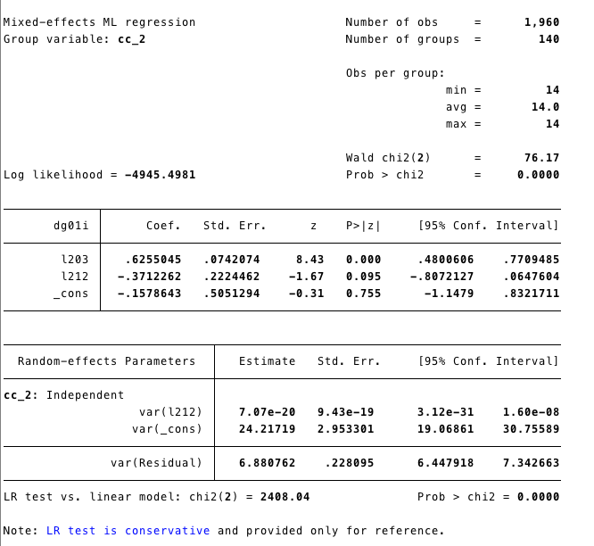
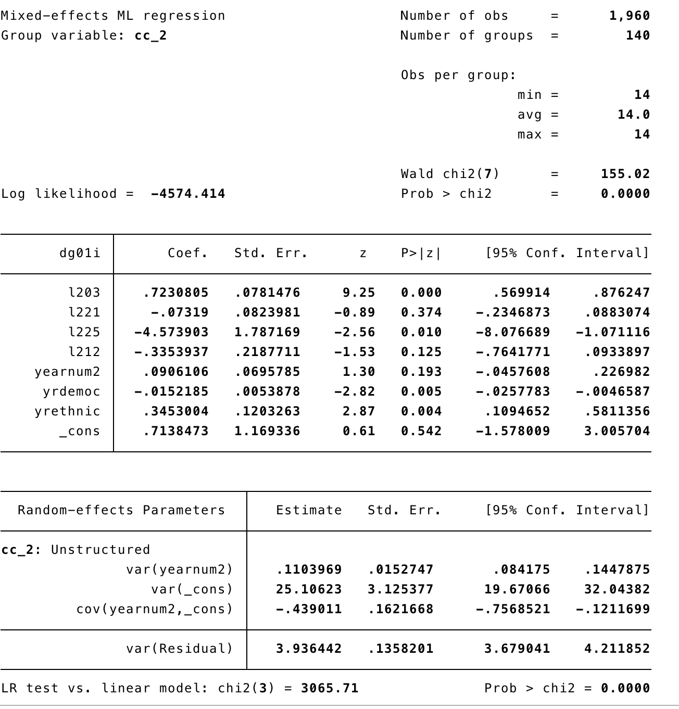
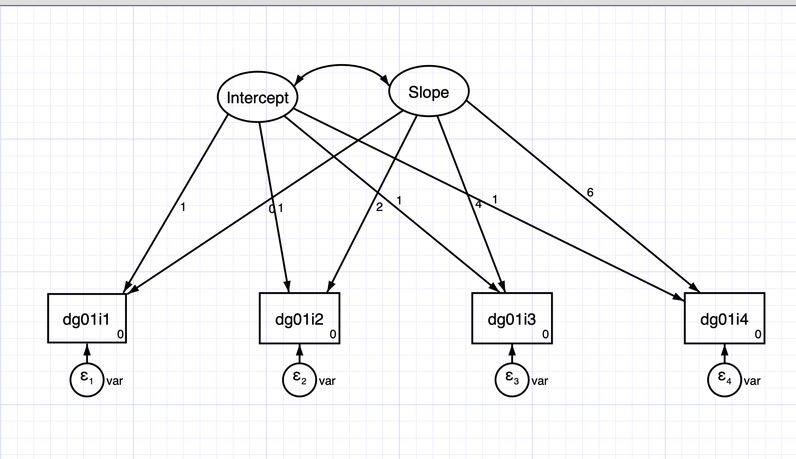

# Econometric Multilevel Models <a name="ECO_Multilevel"></a>

Multilevel models take into account the nested data's structure, where there are data at different levels of aggregation. 

## Random Intercept <a name="mixed1"></a>

A multilevel model for the intercept can be represented as: 

$$
Y_{it}=\beta_{0}+\beta_{1}X_{1it}..+ e_{it}
$$

Second Level: 

$$
\beta_0= \beta_{00}+ \beta_1*X_1+... \zeta_{0i}
$$


Where the intercept does not have any independent variable, the "mixed" form can be represented as:

$$
Y_{it}=\beta_{00}+\beta_{1}X_{1it}..+\zeta_{0i}+ e_{it}
$$

Which is the same as the Random Effect Model we explained in the econometric section [here](#RE)

Lets work in STATA:

### <span style="color:red">**STATA**</span>

The model:

- We are going to use the dataset XXXX. 
- The model is: 

$$
Y_{it}=\beta_{00}+\beta_1*l203_{it}+\beta_2*l2020_{it}+\zeta_i+\epsilon_i
$$

- In this case, we are using the variable l203 and l212 as predictors of the intercept at the second level.
- $\beta_1$ and $\beta_2$ are the fixed effect part of the model. - $\zeta_i+\epsilon_i$ are the random effects
- The command mixed (is for mixed models)

```{r eval=FALSE}
mixed dg01i l203 l212 || cc_2: 
```

Output:

```{r echo=FALSE, out.width='80%'}
knitr::include_graphics('./Stata_images/mixed1.png')
```

### <span style="color:red">**R**</span>

- For mixed models, we will use the function ```lmer``` from the package **lm4** 

- In this case, the model seems similar to what we have done before. The "fixed effect part" comes first ```dg01i~l203+l212``` and we add the random effect ```(1|cc_2)``` for the intercept.

```{r}
library(rio)
demo<-import("./datasets/democracy.dta")
```

```{r}
library(lme4)
m1<-lmer(dg01i~l203+l212+(1|cc_2) , data=demo)
```

```{r}
summary(m1)
```

We get the same output as STATA.

## Random Slope <a name="mixed2"></a>

We can add the a random effect to the l2020's slope as well. The mixed model would be represented as:

$$
Y_{it}=\beta_{00}+\beta_1*l203_{it}+\beta_2*l2020_{it}+\zeta_{it}+\epsilon_i+ \zeta_{1it}*l2020
$$


### <span style="color:red">**STATA**</span>

```{r, eval=FALSE}
mixed dg01i l203 l212 || cc_2: l212
```

output:

```{r echo=FALSE, out.width='80%'}

```

### <span style="color:red">**R**</span>

- We add the random effect to the intercept pf l212

```{r}
m2<-lmer(dg01i~l203+l212+(l212||cc_2), data=demo)
```

```{r}
summary(m2)
```

## Growth Models <a name="mixed3"></a>

A growth model it is a especial type of multilevel model where time is an independent variable. 

$$ 
Y_{it}= \beta_0+ \beta_1*Time+e_{it}
$$ 

**Second Level**
$$
\beta_0=\beta_{00}+\beta_{01}*l203+\beta_{02}*l225+\beta_{03}*l212+\zeta_{00}
$$
slope: 
$$
\beta_1=\beta_{10}+\beta_{11}*l203+\beta_{12}*l225+\zeta_{11}
$$

**Mixed model**

$$
Y_{it}=\beta_{00}+\beta_{01}*l203+\beta_{02}*l225+\beta_{03}*l212+ \beta_{10}*TIME+\beta_{11}*l203*TIME+\beta_{12}*l225*TIME+\zeta_{11}*Time+\zeta_{00}+e_{it}
$$

### <span style="color:red">**STATA**</span>

- To estimate the model above in STATA:
- First, we need to standardize the variable TIME 

```{r,eval=FALSE}
gen yearnum2=yearnum-1 
```

- Then, we need to construct the interaction terms

```{r, eval=FALSE}
gen yrdemoc=yearnum2*l203  
gen yrethnic=yearnum2*l225
```

- Finally we run the mixed model

```{r, eval=FALSE}
mixed dg01i l203 l221 l225 l212 yearnum2 yrdemoc yrethnic || cc_2:  yearnum2 , cov (unstructured)
```

**Output** 

```{r echo=FALSE, out.width='80%'}

```

### <span style="color:red">**R**</span>

- First we create the variable ```yearnum2`` that recodes the yearnum so there is a zero point at the beginning of the series. 

```{r}
demo$yearnum2<-demo$yearnum-1
```

- We don't need to create the interaction variables. We can add the interaction straight to the model ```l203*yearnum2+ l225*yearnum2```. 
               

```{r}
m3<-lmer(dg01i~yearnum2+l203+l221+l225+l212+l203*yearnum2+
               l225*yearnum2+
               (1|cc_2)+(1|yearnum2) , data=demo)
```

**output**

```{r}
summary(m3)
```

- The model has three random effects and eight fixed effects. 


# SEM Multilevel Models <a name="SEM_Multilevel"></a>

Here we are going to estimate a Latent Growth Model using the SEM framework. 

## <span style="color:red">**STATA**</span>

This model has a random effect for the intercept and the slope. 

```{r echo=FALSE, out.width='80%'}

```

For this model we are going to use the data XXXX in its wide format. 

```
sem (dg01i1 <- _cons@0, ) (dg01i2 <- _cons@0, ) (dg01i3 <- _cons@0, ) 
(dg01i4 <- _cons@0, ) (Intercept@1 -> dg01i1, ) (Intercept@1 -> dg01i2, ) (Intercept@1 -> dg01i3, ) (Intercept@1 -> dg01i4, ) (Slope@0 -> dg01i1, ) (Slope@2 -> dg01i2, ) (Slope@4 -> dg01i3, ) (Slope@6 -> dg01i4, ), covstruct(_lexogenous, diagonal) latent(Intercept Slope ) cov( e.dg01i1@var e.dg01i2@var e.dg01i3@var e.dg01i4@var Intercept*Slope) means( Intercept Slope) nocapslatent
```
```{r echo=FALSE, out.width='80%'}
knitr::include_graphics('./Stata_images/semm2.png')
```

## <span style="color:red">**R**</span>

```{r}
demo<-import("./datasets/democracy1996-2002.wide.dta")
```

```{r}
semG<-
  '
## Latents
Intercept=~1*dg01i1+1*dg01i2+1*dg01i3+1*dg01i4
Slope=~1*dg01i1+2*dg01i2+4*dg01i3+6*dg01i4
## Covariance
Intercept~~Slope
## Covariance
## Fixing variance
dg01i1~~x*dg01i1
dg01i2~~x*dg01i2
dg01i3~~x*dg01i3
dg01i4~~x*dg01i4
'
```

```{r}
library(lavaan)
semGm<-sem(semG, data=demo)
summary(semGm)
```

```{r}
library(semPlot)
semPaths(semGm)
```
