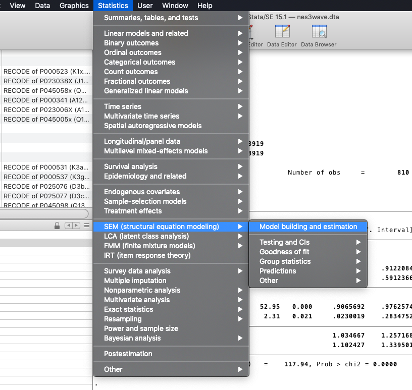
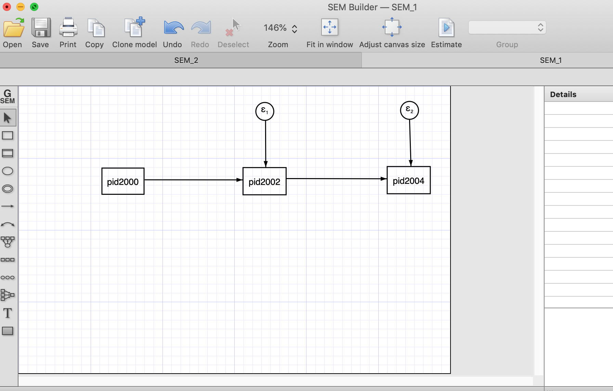
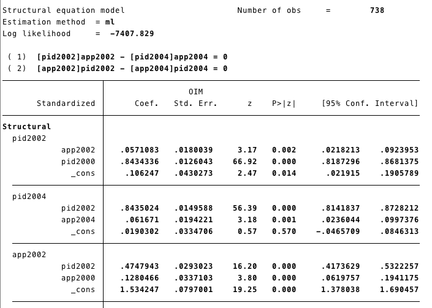
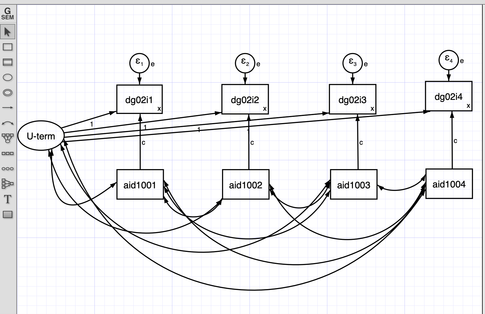
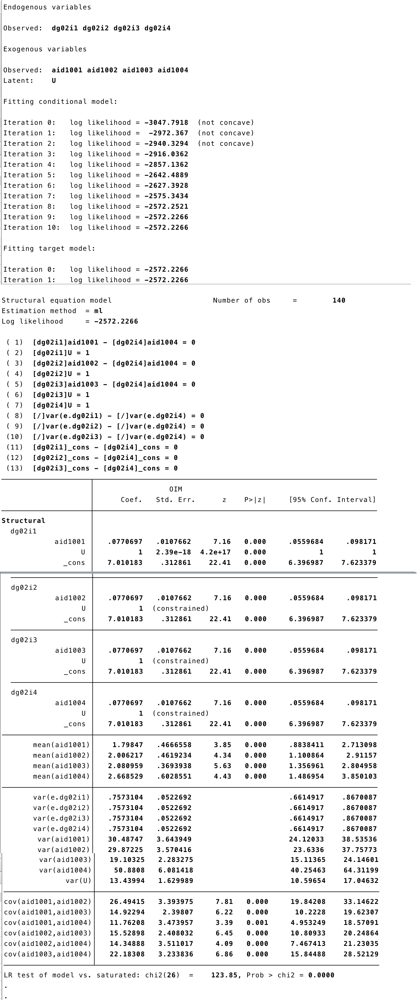

```{css, echo=FALSE}
.Comment1 {
background-color: paleTurquoise;
}
```

```{r setup, include=FALSE}
knitr::opts_chunk$set(echo = TRUE)
```

Also known as "Covariance Structure Analysis" (CSA). We used observed variance-covariances to estimate structural parameters and we use the estimated structural parameters to generate predicted variances and covariances.

In SEM we care about: regression coefficients, $R^2$ and overall fit of the model. 


In this section, we will use data adapted from: <a name="Datas"></a>

American National Election Studies - 2000-2002-2004

**Datasets:** 

 - nes3wave.dta [Download](https://github.com/jincio/STATAtoR/raw/master/datasets/nes3wave.dta)
 

Effects of US Foreign Assistance on Democracy Building: Results of a Cross-National Quantitative Study (Final report, prepared for USAID) Finkel, Steven E., Anibal Perez-Linan, Mitchell A. Seligson, and Dinorah Azpuru. 2006

**Dataset:** 
 
 - democracy1996-2002.dta [Download](https://github.com/jincio/STATAtoR/raw/master/datasets/democracy1996-2002.dta)

Download the files into your computer. We had saved the data-files in a folder called "datasets," that is why our roots are, for instance: "./datasets/nes3wave.dta.dta"

# Autoregressive model (Three waves) <a name="autoregresive"></a>

- For this mode we will use the data "nes3wave". You can check more details of the data [here](#packages)

## <span style="color:red">**STATA**</span>

- Getting the data:

```{r, eval=FALSE}
use "./datasets/nes3wave.dta", clear
```


- SEM in STATA can be done with commands in the **do** file, but also has an "SEM builder", which is more intuitive for SEM models. 

- You can open the "SEM builder" from the menu "Statistic" (figure below)

```{r echo=FALSE, out.width='80%'}

```

- A different window will open where you can build your model (figure below). 

```{r echo=FALSE, out.width='80%'}
knitr::include_graphics('./Stata_images/SEM2.png')
```

Below is how an autoregressive model would look with three waves (using the SEM builder). To estimate the model, we need to click "Estimate" (right on the horizontal menu)

```{r echo=FALSE, out.width='80%'}

```

After the estimation (using Maximum Likelihood) we estimate the estructural estimates and the error terms. 

```{r echo=FALSE, out.width='80%'}
knitr::include_graphics('./Stata_images/SEM4.png')
```

Another way to estimate SEM model is using STATA code:

```{r eval=FALSE}
sem (pid2000 -> pid2002, ) (pid2002 -> pid2004, ), nocapslatent
```

```{r echo=FALSE, out.width='80%'}
knitr::include_graphics('./Stata_images/SEM5.png')
```

- As we mentioned above fit measures are important for SEM models. We can obtain that in STATA running ```estat gof, sta(all)``` after estimating the model.

```{r echo=FALSE, out.width='80%'}
knitr::include_graphics('./Stata_images/SEM6.png')
```

## <span style="color:red">**R**</span>

- For this model we are going to use the data **XXX** from the XXXXX
- We get the data using the function ```import``` from the package **rio**

 
```{r}
library(rio)
new<-import("./datasets/nes3wave.dta")
```

- To run SEM we are going to use the package **lavaan** 
- The first step is to call the package using ```library(lavaan)```
- Then we write our model as string.
- ```pid2002 ~ pid2000``` set the structural effect of pid2000 on pid2002.It corresponds to the STATA code ```(pid2000 -> pid2002, )```
- Our model has two structural effects:
    - pid2002 ~ pid2000
    - pid2004 ~ pid2002
- Then we estimate the model using the function **sem** from the package ```lavaan```
- Finally, we used the function ```summary``` to retrieve the information from our model. 

```{r}
library(lavaan)

```

```{r}
path1<- 
'pid2002 ~ pid2000 
 pid2004 ~ pid2002 
'
## pid2000 is the exogenous variable.
## The models have to be in different lines
```

```{r}
sem1 <-sem(path1, data=new)
## The objecto sem1 has all the information from the estimation process.
summary(sem1)
```

- We can also get the model's fit information adding an argument ```fit.measures=TRUE``` into ```summary```. We have the same information as the STATA command ```estat gof, sta(all)```


```{r}
summary(sem1,fit.measures=TRUE )
```

#### <span style="color:red">**SEM ploting with R**</span>

- To plot the model we will need the package **semPlot**
- We call the package with library()
- And we use ```semPaths`` to get the basic plot of our SEM model.

```{r}
library(semPlot)
semPaths(sem1)
```

- ```semPlot``` has a lot of arguments, and we can customize the plot using these arguments. For instance, we can add the coefficients and give weight (based on the coefficients) to the arrows. 

- We will explore these arguments progressively. Lets start changing the style to "lisrel". This option changes the plot and shows a single headed edges with no node as origin."Estimates" add the estimates to the arrows.

```{r}
semPaths(sem1,"Estimates", style="lisrel",
         layout = "tree")
```


# Cross-lagged models <a name="clagged"></a>

## <span style="color:red">**STATA**</span>

```{r echo=FALSE, out.width='80%'}
knitr::include_graphics('./Stata_images/clagged1.png')
```

**Code:** 

```{r, eval=FALSE}
sem (pid2000 -> pid2002, ) (pid2000 -> app2002, ) //
(app2000 -> pid2002, ) (app2000 -> app2002, ),  //
cov( pid2000*app2000) standardized 
```

```{r echo=FALSE, out.width='80%'}
knitr::include_graphics('./Stata_images/clagged2.png')
```

## <span style="color:red">**R**</span>

- First, lets write our model.
- Similar to the autorregressive model (above), the cross-lagged model has structural effects. For instance ```pid2002 ~ pid2000 + app2000```
- We are adding covariances, for this model ```app2000~~pid2000```. This corresponds to the STATA code ```cov( pid2000*app2000)```

```{r}
cl1<-
  '
pid2002 ~ pid2000 + app2000
app2002 ~ app2000 + pid2000
## Covariances
app2000~~pid2000
'
```

- Then we estimate it 

```{r}
cl1<- sem(cl1, data=new)
```

- Now, we ask for the results. Adding the option ```standardized=TRUE``` add the standaridized coefficients (last column)

```{r}
summary(cl1,standardized=TRUE)
```

```{r}
semPaths(cl1,"Estimates",standardized=TRUE, 
         layout="tree2")
```


# Synchronous and cross-lagged model <a name="SCL"></a>

- This model has two new features. First it has a reciprocal effect, meaning that the variables can affect each other in a given time. 

- We added equality constraints to the coefficients accross waves. For instance, the effect from **pid2004** to **app2004** we had constrained  (```a```) to be the same as the **pid2002** to **app2002**. The same way, we used (```b```) to constrained the effect from **app2004** to **pid2004** to be the same as **app2002** to **app2002**


## <span style="color:red">**STATA**</span>

- We can add those constraints in the SEM builder by first selecting the arrow and then adding the constraint (Red box at the top left corner)

```{r echo=FALSE, out.width='80%'}
knitr::include_graphics('./Stata_images/clagged3.png')
```

**Code**

- We can add the constraints to the effect using the @. For instance, ```(pid2002@a -> app2002, )``` and ```(pid2004@a -> app2004, )``` are equally constrained (we have added the @a to both)

```{r, eval=FALSE}
sem (pid2000 -> pid2002, ) (pid2002 -> pid2004, ) (pid2002@a -> app2002, ) /// (pid2004@a -> app2004, ) (app2000 -> app2002, ) (app2002@b -> pid2002, ) ///
(app2002 -> app2004, ) (app2004@b -> pid2004, ), ///
standardized cov( pid2000*app2000) nocapslatent
estat gof, sta(all)
```

- We wont show the whole output here, but in this section you can see that the effects of [pidd2002]app2002  and [pidd2002]app2002 are equal. 

```{r echo=FALSE, out.width='80%'}

```

## <span style="color:red">**R**</span>

- We use a similar idea to add constrains to our model. In this case, we multiply for the same constants where we want to equally constrain.

```{r}
cls1<-
  '
pid2002 ~  pid2000 + app2000 + b*app2002
app2002 ~  app2000 + pid2000 + a*pid2002
pid2004 ~  pid2002 + app2002 + b*app2004
app2004 ~  app2002 + pid2002 + a*pid2004
## Covariances
app2000~~pid2000
#app2002~~0*pid2002
'
```

- Now we run the model and ask for the results with summary

```{r}
cl1s1m <- sem(cls1, data=new)
summary(cl1s1m, standardized =TRUE)
```

- This time we are changing the layout to ```tree2```

```{r}
semPaths(cl1s1m,standardized=TRUE, layout = "tree2")
```

# Measurement error model <a name="ME"></a>

Measurement erros is especially problematic for panel analysis. In SEM framework we can deal with this in a simple way. For instance, lets take our **Autoregressive model** and lets model its measurement error. We will model the Wiley-Wiley solution ( assuming equal measurement error)  in order to have an identified model.

In our model we use the error's variance as constrained:

$$ 
Var(w)=Var(y_{2}^*)- \frac{Cov(y_{2}^*,y_{3}^*)Cov(y_{1}^*,y_{2}^*)}{Cov(y_{1}^*,y^*_3)}
$$

- More details about this in Finkel (1995)
- We can obtain our variance-covariance matrix in R. 
- First, we ```select``` the variables we need to obtain our matrix using the function **var**.
- Lets do it using the the function ```select``` from **dplyr** and ```%>%``` to do everything in one line.


```{r}
library(dplyr)
new%>%dplyr::select(pid2000,pid2002,pid2004)%>%
  var(na.rm=TRUE)
```

Then following the formula we have that

```{r}
4.75-(4.47*4.11)/4.30
```

- Round to two digits using the function ```round```

```{r}
round(4.75-(4.47*4.11)/4.30,2)
```

## <span style="color:red">**STATA**</span>

- Using the SEM builder we create the latent variables for each variable and constraint its error variance to 0.48. 

- The red box shows where you can impose constraint to the variance error variance.

```{r echo=FALSE, out.width='80%'}
knitr::include_graphics('./Stata_images/me1.png')
```

```{r, eval=FALSE}
sem (P2002 -> pid2002, ) (P2002 -> P2004, ) (P2004 -> pid2004, ) (P2000 -> pid2000, ) (P2000 -> P2002, ), latent(P2002 P2004 P2000 ) cov( e.pid2000@0.48 e.pid2002@0.48 e.pid2004@0.48) nocapslatent
```

**output** 

```{r echo=FALSE, out.width='80%'}
knitr::include_graphics('./Stata_images/me2.png')
```

## <span style="color:red">**R**</span>

- We have to add latent variables to our model. To model latent variables we use ```=~```. 
- To fix the error variance we multiply it by 0.48 

```{r}
e1<-
  '
## Latents
P2000=~pid2000
P2002=~pid2002
P2004=~pid2004
## Regresion

P2002~P2000
P2004~P2002

## Fixing Error
pid2000~~0.48*pid2000
pid2002~~0.48*pid2002
pid2004~~0.48*pid2004
'
```


```{r}
e1m <- sem(e1, data=new)
```

```{r}
summary(e1m)
```

```{r}
semPaths(e1m, "est")
```

# SEM Fixed Effects <a name="SEM2_1"></a>

We can incorporate unobserved heterogeneity within the SEM model. In order to do this we use an unobserved latent variable. 

For this section we will use the democracy1996-2002.dta dataset; it is in a wide format. You can review about data's formats (wide and long) here [Data organization](#Panel_Data)

## <span style="color:red">**STATA**</span>

```{r, eval=FALSE}
use "./datasets/democracy1996-2002.wide.dta", clear
```

In this model the *latent* U correlates with the independent variables and havea constant effect on the dependent variable. 

```{r echo=FALSE, out.width='80%'}

```

We can also estimate the same model using STATA **do** file. 

```{r, eval=FALSE}
sem (dg02i1 <- _cons@x, ) (dg02i2 <- _cons@x, ) (dg02i3<-_cons@x, ) (aid1001@c -> dg02i1, ) (aid1002@c -> dg02i2, ) (aid1003@c -> dg02i3, ) (U@1 -> dg02i1, ) (U@1 -> dg02i2, ) (U@1 -> dg02i3, ) (U@1 -> dg02i4,) (dg02i4 <- _cons@x, ) (aid1004@c -> dg02i4, ), covstruct(_lexogenous, diagonal) cov(_lexogenous*_oexogenous@0) latent(U ) cov( e.dg02i1@e e.dg02i2@e e.dg02i3@e aid1001*aid1002 aid1001*aid1003 aid1001*aid1004 aid1002*aid1003 aid1002*aid1004 aid1003*aid1004 U*aid1001 U*aid1002 U*aid1003 U*aid1004 e.dg02i4@e) nocapslatent
```

```{r echo=FALSE, out.width='80%'}
knitr::include_graphics('./Stata_images/fe_sem.png')
```

Summarizing: 
- This model has a **latent** U term that represents the unobserved heterogeneity that does not change with time. 
- This U is correlated with the independent and dependent variable. This correlation is constant in time. 
- We set a constant effect from the independent variable for each time. 
- We also set the variance of the dependent variable constant in each time.

## <span style="color:red">**R**</span>

Lets import the data with the function ```import``` from the package **rio**

```{r}
demo<-import("./datasets/democracy1996-2002.wide.dta")
```

We use the package *Lavaan*.

- First, we set the *latent* U term: ```U_term=~1*dg02i1+1*dg02i2+1*dg02i3+1*dg02i4``` Multiplying the variables to 1 we are constraining the loads. 
- Then we set the models for instance```dg02i1~c*aid1001```. Here **dg02i1** is the dependent variable and **aid1001** is the dependent variable. We are multiplying every regression with *c*, then the effects are constrained. 

- We would like to constraint the intercepts too. We do it by multiplying the 1 with a constant. ``` dg02i1~x*1``` 

- Finally, we also constrain the variance with a constant ```dg02i1~~x*dg02i1```

```{r}
semf<-
  '
## Latents
U_term=~1*dg02i1+1*dg02i2+1*dg02i3+1*dg02i4
## Regresion
dg02i1~c*aid1001
dg02i2~c*aid1002
dg02i3~c*aid1003
dg02i4~c*aid1004
## Intercepts
dg02i1~x*1
dg02i2~x*1
dg02i3~x*1
dg02i4~x*1
## Covariance
U_term~~aid1001
U_term~~aid1002
U_term~~aid1003
U_term~~aid1004
aid1001~~aid1002
aid1001~~aid1003
aid1001~~aid1004
aid1002~~aid1003
aid1002~~aid1004
aid1003~~aid1004
## Constraining the variance
dg02i1~~x*dg02i1
dg02i2~~x*dg02i2
dg02i3~~x*dg02i3
dg02i4~~x*dg02i4
'
```

```{r}
SEMf<-sem(semf, data=demo)
summary(SEMf)
```

```{r}
semPaths(SEMf)
```

# SEM Random Effects <a name="SEM2.2"></a>

A Random Effect asumes that the U term does not correlates with the independent variables. Therefore, from our previous model we can get rid of those covariances and have a RE model. 

## <span style="color:red">**STATA**</span>

```{r echo=FALSE, out.width='80%'}
knitr::include_graphics('./Stata_images/semre1.png')
```

```{r, eval=FALSE}
sem (dg02i1 <- _cons@x, ) (dg02i2 <- _cons@x, ) (dg02i3 <- _cons@x, ) (dg02i4 <- _cons@x, ) (aid1001@c -> dg02i1, ) (aid1002@c -> dg02i2, ) (aid1003@c -> dg02i3, ) /// 
 (U@1 -> dg02i1,) (U@1 -> dg02i2, ) (U@1 -> dg02i3, ) (U@1 -> dg02i4, ) (aid1004@c -> dg02i4, ), covstruct(_lexogenous, diagonal) cov(_lexogenous*_oexogenous@0) /// 
 latent(U ) cov(e.dg02i1@e e.dg02i2@e e.dg02i3@e e.dg02i4@e) nocapslatent

```

```{r echo=FALSE, out.width='80%'}

```


## <span style="color:red">**R**</span>

- We have removed the covariance from the U term to the independent variables. 

```{r}
semRE<-
  '
## Latents
U_term=~1*dg02i1+1*dg02i2+1*dg02i3+1*dg02i4
## Regresion
dg02i1~x*1+c*aid1001
dg02i2~x*1+c*aid1002
dg02i3~x*1+c*aid1003
dg02i4~x*1+c*aid1004
## Covariance
aid1001~~aid1002
aid1001~~aid1003
aid1001~~aid1004
aid1002~~aid1003
aid1002~~aid1004
aid1003~~aid1004
## Fixing variance
dg02i1~~x*dg02i1
dg02i2~~x*dg02i2
dg02i3~~x*dg02i3
dg02i4~~x*dg02i4
'
```

```{r}
semREm<-sem(semRE, data=demo)
summary(semREm)
```

```{r}
semPaths(semREm)
```

