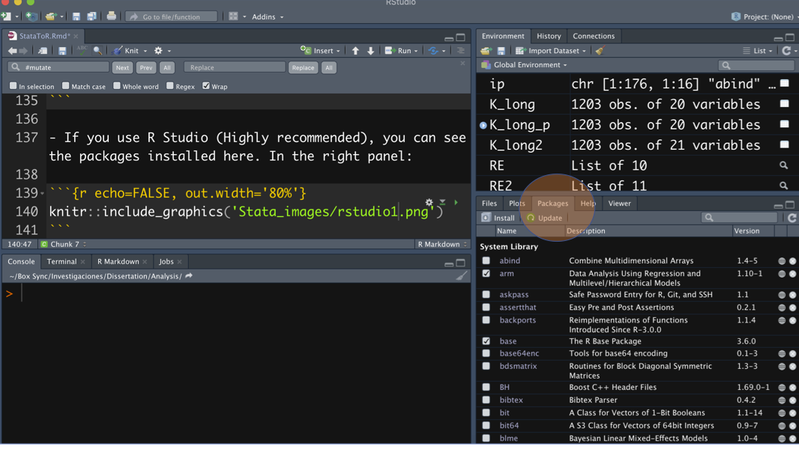

```{r setup, include=FALSE}
knitr::opts_chunk$set(echo = TRUE)
```

```{r eval=FALSE, echo=FALSE}
#knit: (function(input_file, encoding) {
#  out_dir <- 'docs';
#  rmarkdown::render(input_file,
# encoding=encoding,
# output_file=file.path(dirname(input_file), out_dir, #'index.html'))})
#output: html_document
```

# Introduction <a name="introduction"></a>

With this page, we want to help students, researchers, and practitioners that are used to STATA to include R in their analytic toolbox. Likewise, we present some of the most used panel analysis' technics showing the potential of different approaches. 

This page is not a statistic textbook; we won't discuss the statistic assumptions or mathematical derivations behind the technics. We are assuming two things. First, the reader has enough statistical background to understand the strengths and limitations of each model. Second, the user knows more STATA than R. Therefore, our STATA code will have less comments than the R code. Navegate among the topics covered here using the top menu. 

Here are some textbooks that we recommend for panel analysis: 

  - Allison, Paul. 2009. Fixed Effects Regression Models. Thousand Oaks, Ca.: Sage Publications.
  - Finkel, Steven E. 1995. Causal Analysis with Panel Data. Thousand Oaks, Ca.: Sage Publications. (Royalties donated to University of Pittsburgh Chapter, Pi Sigma Alpha, Political Science Undergraduate Honor Society).
  - Andreß, Golsch, and Schmidt. 2013. Applied Panel Data Analysis for Economic and Social Surveys. Heidelberg: Springer-Verlag.
  
# Authors: 

## Steve Finkel

Steven E. Finkel Daniel Wallace Professor of Political Science at the University of Pittsburgh. His areas of expertise include comparative political behavior, public opinion, democratization, and quantitative methods. Since 1997, he has conducted evaluations of the effectiveness of US and other international donors' civic education programs in South Africa, Poland, the Dominican Republic, and Kenya. He has also pioneered the use of survey research as an aid to peace negotiations in conflict settings such as Sri Lanka and Kosovo. He is the author of Causal Analysis with Panel Data (Sage Publications, 1995) as well as numerous articles on political participation, voting behavior, and civic education in new and established democracies. Between 2004 and 2007, he conducted the first macro-comparative evaluation of the impact of all USAID democracy assistance programs on democratic development in recipient countries (published in World Politics, 2007). He holds a PhD in political science from the State University of New York at Stony Brook, and has taught previously at the University of Virginia, Arizona State University, and the Hertie School of Governance in Berlin, Germany.

Website: http://www.stevenfinkel.info/index.html

## José Incio

José Incio is a Ph.D. Candidate at the University of Pittsburgh. His research interest include subnational politics, democracy, and political methodology.

website: www.joseincio.com 

# Basics

**Code:** 

STATA and R code will be in grey boxes like this: 

```{r, eval=FALSE}
Code here 
```

Notes about R, and R features will be in turquoise boxes like this:

```{r eval=FALSE, class.source="Comment1"}
Example
```

Sometimes the output has warnings, we are not showing those here. In general, you shouldnt worry about warnings. When the ouput shows "error" that means something is wrong and didn't execute the code. 

## R packages and data sets <a name="packages"></a>

We are going to use the following packages: 

**For data managment: **

- rio: [rio](https://cran.r-project.org/web/packages/rio/index.html "rio package")
- dplyr: [dplyr](https://cran.r-project.org/web/packages/dplyr/dplyr.pdf "dplyr package")
- tidyr: [tidyr](https://cran.r-project.org/web/packages/tidyr/index.html "dplyr package")

**For modeling: **

- lme4: [lme4](https://cran.r-project.org/web/packages/lme4/lme4.pdf "lme4 package")
- plm: [plm](https://cran.r-project.org/web/packages/plm/plm.pdf "plm package")
- lmtest [lmtest](https://cran.r-project.org/web/packages/lmtest/index.html "lmtest")
- panelr: [panelr](https://cran.r-project.org/web/packages/panelr/index.html "panelr package")
- lavaan: [lavaan](https://cran.r-project.org/web/packages/lavann/index.html "lavann package")
- semPlot: [semPlot](https://cran.r-project.org/web/packages/lavann/index.html "semPlot package")

Here is some resources to learn the most basic steps:

  - How to install R and Rstudio [video](https://www.youtube.com/watch?v=orjLGFmx6l4 "install")
  - How to install packages in R [video]( https://www.youtube.com/watch?v=Fyy9Eqp2AA0 "packages")


Let's install all our packages at once.

- Packages are grouped using "c()" and separated by ",". It is possible to install one by one, or several at the same time.
- You need to install a package **only one time**.

```{r, eval=FALSE}
install.packages(c("lme4", "panelr","plm","rio","lmtest","dplyr","tidyr", "lavaan","semPlot"))
```


- If you want to know which packages you have installed use the code below (Becareful, the output could be long.):

```{r, eval=FALSE}
installed.packages(.Library)
```

- If you use R Studio (Highly recommended), you can see the packages installed here. In the right panel:

```{r echo=FALSE, out.width='80%'}

```


